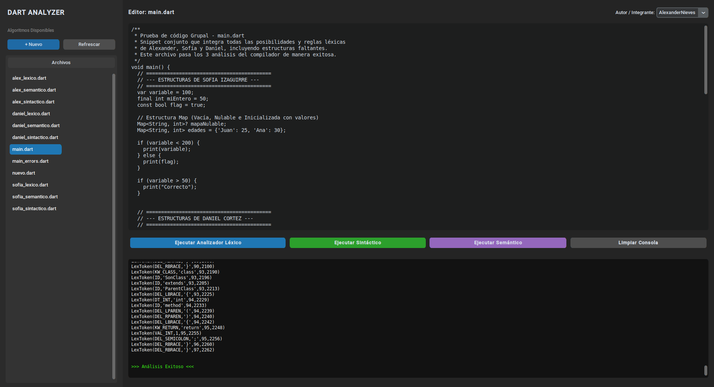

# Dart Analyzer - Frontend GUI

Esta es la interfaz gráfica de usuario (GUI) para el **Dart Analyzer**, desarrollada en Python utilizando la librería **CustomTkinter** para proporcionar una estética oscura, moderna y fluida.

La GUI permite visualizar los archivos de algoritmos Dart, editarlos directamente con una fuente monoespaciada, y ejecutar análisis léxicos, sintácticos y semánticos individuales visualizando los resultados con formato y color de terminal (verde para éxito, rojo para errores).



---

## Características de la Interfaz

1. **Gestor de Archivos (Izquierda):**
   * Escanea automáticamente la carpeta de algoritmos (`backend/algorithms/`).
   * Permite alternar entre archivos con resaltado de selección.
   * Botón **`+ Nuevo`** para crear nuevos archivos `.dart` desde la interfaz.
   * Botón **`Refrescar`** para sincronizar cambios externos.
2. **Editor de Código (Centro):**
   * Área de texto multilínea con tipografía monoespaciada (`Consolas`/`Courier`).
   * Sistema de auto-guardado automático al cambiar de archivo o al presionar cualquier botón de ejecución.
   * Menú desplegable para seleccionar el **Autor / Integrante** asignado (AlexanderNieves, SofiaIzaguirre, DanielCortez). Esto asocia la autoría correcta en los logs generados bajo `backend/logs/`.
3. **Consola de Resultados (Abajo):**
   * Contenedor estilo terminal oscuro.
   * Resaltado inteligente: texto en verde brillante (`Análisis Exitoso`) ante ejecuciones correctas, y texto en rojo brillante ante errores léxicos, sintácticos o semánticos con la línea y detalle correspondiente.
   * Botón **`Limpiar Consola`** para vaciar el historial.

---

## Requisitos de Instalación

### 1. Dependencias de Python
El frontend utiliza `customtkinter` para los controles gráficos. Instala las dependencias dentro del entorno virtual de la carpeta `frontend`:

```bash
cd frontend
python3 -m venv venv
source venv/bin/activate  # En Windows: venv\Scripts\activate
pip install -r requirements.txt
```

### 2. Dependencia del Sistema (Solo Linux: Pop!_OS / Ubuntu / Debian)
En sistemas Linux basados en Debian, las librerías gráficas de Tkinter no vienen por defecto en la instalación de Python. Si al iniciar la aplicación obtienes el error `ModuleNotFoundError: No module named 'tkinter'`, debes instalar el paquete del sistema ejecutando:

```bash
sudo apt update && sudo apt install -y python3-tk
```

---

## Métodos de Ejecución

### Desde la Terminal (Recomendado)
Una vez configurado el entorno virtual y la librería de sistema, ejecuta:

```bash
cd frontend
./venv/bin/python src/app.py
```

### Desde VS Code (Launch Configuration)
El proyecto incluye un archivo de depuración configurado.
1. Ve a la pestaña **Run and Debug** (`Ctrl + Shift + D`).
2. Selecciona **`Dart Analyzer UI: Launch Frontend`** en el menú desplegable.
3. Presiona **`F5`** (para ejecutar con el depurador adjunto) o **`Ctrl + F5`** (para ejecutar libremente sin detenerse en excepciones no controladas).
__Nota: Para una presentación ejecutar con `Ctrl + F5`__